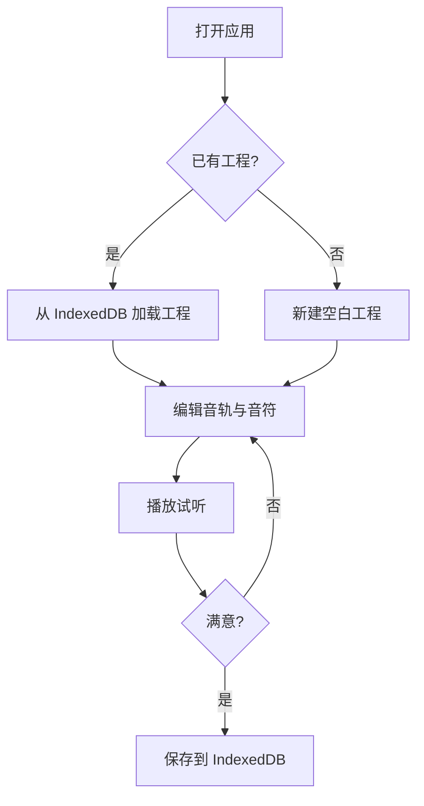

## 1. 产品概述

轻量钢琴卷帘编辑器——一款纯浏览器端运行的 MIDI 编曲小工具。灵感来时打开即用，画音符、调音高时值、分音轨叠编、点播放听效果，全程本地离线，无需安装 DAW 或注册在线服务。

- 核心痛点：灵感闪现时缺少趁手且纯本地的旋律记录工具
- 目标用户：爱写小段子的音乐爱好者、编曲练习者、旋律创作者
- 产品价值：零门槛、零安装、零联网，打开浏览器就能写歌

## 2. 核心功能

### 2.1 用户角色

| 角色 | 使用方式 | 核心权限 |
|------|----------|----------|
| 普通用户 | 打开浏览器直接使用 | 全部编辑、播放、保存功能 |

### 2.2 功能模块

1. **编辑页**：钢琴卷帘画布、音符绘制/拖拽/缩放、音轨面板、工具栏、播放控制条
2. **工程管理面板**：新建/打开/保存工程、音轨增删与属性编辑

### 2.3 页面详情

| 页面名称 | 模块名称 | 功能描述 |
|----------|----------|----------|
| 编辑页 | 钢琴卷帘画布 | Canvas 绘制网格+音符；鼠标点击/拖拽创建、移动、拉伸音符；纵向音高映射、横向时间映射 |
| 编辑页 | 音符编辑面板 | 选中音符后微调音高、力度、起始时间、时值 |
| 编辑页 | 音轨面板 | 左侧音轨列表，支持增删音轨、切换当前编辑音轨、音轨静音/独奏、音色选择 |
| 编辑页 | 播放控制条 | 播放/暂停/停止、循环开关、BPM 调节、播放指针位置显示 |
| 编辑页 | 工具栏 | 选择工具、画笔工具、橡皮擦工具、量化吸附开关、缩放控制 |
| 编辑页 | 工程管理 | 新建工程、保存到 IndexedDB、从 IndexedDB 加载、工程列表浏览 |

## 3. 核心流程

用户打开应用 → 新建或加载工程 → 选择/创建音轨 → 在卷帘上绘制/编辑音符 → 点播放试听 → 调整音符参数 → 保存工程

## 4. 用户界面设计

### 4.1 设计风格

- **主色调**：深色背景 (#0f0f14) 搭配霓虹青色 (#00e5c8) 强调色，营造专业音乐工作站氛围
- **辅助色**：暗灰 (#1a1a24) 用于面板背景，中灰 (#2a2a3a) 用于边框分隔
- **按钮风格**：圆角微凸 (rounded-lg)，hover 时边框发光效果
- **字体**：JetBrains Mono 作为主字体（等宽适合数值展示），搭配 DM Sans 作为 UI 字体
- **布局风格**：顶部工具栏 + 左侧音轨面板 + 中央卷帘画布 + 底部播放控制条
- **音符颜色**：不同音轨使用不同色系（青、橙、粉、紫等），选中音符高亮边框

### 4.2 页面设计概览

| 页面名称 | 模块名称 | UI 元素 |
|----------|----------|---------|
| 编辑页 | 钢琴卷帘画布 | 深色网格背景、彩色音符方块、左侧钢琴键标注、顶部节拍标尺、播放指针线 |
| 编辑页 | 音轨面板 | 半透明暗色面板、音轨名称+颜色指示、静音M/独奏S按钮、音色下拉选择 |
| 编辑页 | 播放控制条 | 播放/暂停/停止图标按钮、循环切换、BPM 数值输入、时间码显示、进度条 |
| 编辑页 | 工具栏 | 图标按钮组（选择/画笔/橡皮擦）、量化吸附开关、缩放滑块 |

### 4.3 响应式设计

- 桌面优先设计，画布区域自适应窗口大小
- 音轨面板可折叠收起，给卷帘更多横向空间
- 最小支持 1024×600 分辨率

### 4.4 3D 场景指导

不适用
