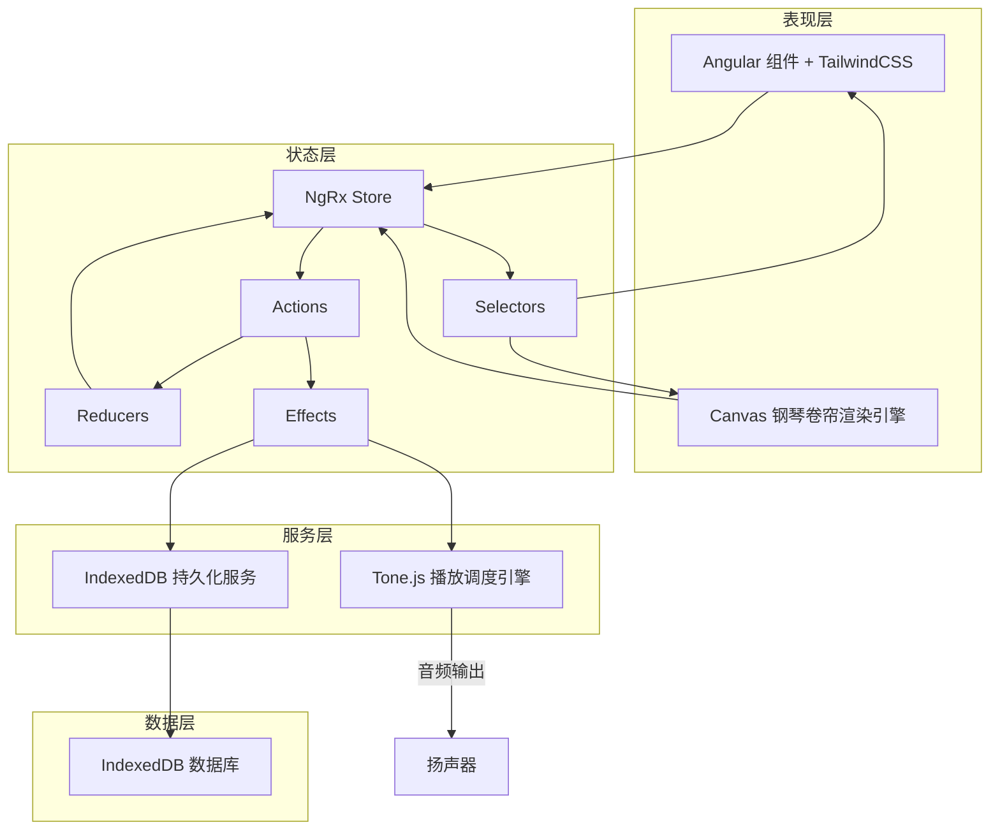
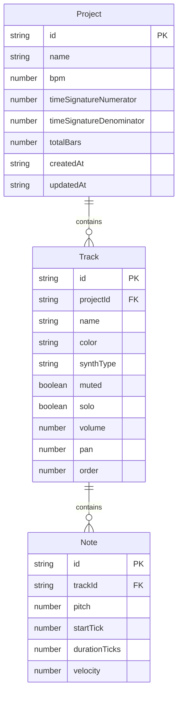

## 1. 架构设计



## 2. 技术说明

- **前端框架**：Angular 17+ + TypeScript
- **样式方案**：TailwindCSS 3
- **状态管理**：NgRx (Store + Effects + Actions/Reducers/Selectors)
- **音色合成与播放**：Tone.js
- **卷帘画布**：HTML5 Canvas 2D
- **数据持久化**：IndexedDB（通过 idb 库封装）
- **构建工具**：Angular CLI (ng build / ng serve)
- **后端服务**：无，纯前端应用

## 3. 路由定义

| 路由 | 用途 |
|------|------|
| `/` | 主编辑页，包含钢琴卷帘、音轨面板、播放控制 |

## 4. 数据模型

### 4.1 核心数据模型



### 4.2 数据定义

**Project（工程）**
- `id`: string, UUID, 主键
- `name`: string, 工程名称
- `bpm`: number, 默认 120
- `timeSignatureNumerator`: number, 默认 4
- `timeSignatureDenominator`: number, 默认 4
- `totalBars`: number, 默认 32
- `createdAt`: string, ISO 时间戳
- `updatedAt`: string, ISO 时间戳

**Track（音轨）**
- `id`: string, UUID, 主键
- `projectId`: string, 所属工程 ID
- `name`: string, 音轨名称
- `color`: string, 十六进制颜色
- `synthType`: string, Tone.js 合成器类型 (Synth | AMSynth | FMSynth | PolySynth)
- `muted`: boolean, 静音
- `solo`: boolean, 独奏
- `volume`: number, -60~0 dB
- `pan`: number, -1~1
- `order`: number, 排序序号

**Note（音符）**
- `id`: string, UUID, 主键
- `trackId`: string, 所属音轨 ID
- `pitch`: number, MIDI 音高 (0~127, 60=C4)
- `startTick`: number, 起始 tick 位置
- `durationTicks`: number, 时值 (tick 单位)
- `velocity`: number, 力度 (0~127)

**Tick 定义**：1 拍 = 480 ticks（PPQ=480），与 Tone.js Transport 对齐

## 5. 模块分层

### 5.1 分层职责

| 层 | 模块 | 职责 | 关键类/文件 |
|----|------|------|------------|
| 数据模型层 | `models/` | 纯数据接口与类型定义 | `note.model.ts`, `track.model.ts`, `project.model.ts` |
| 状态管理层 | `store/` | NgRx Actions/Reducers/Selectors/Effects | `project.actions.ts`, `project.reducer.ts`, `project.selectors.ts`, `project.effects.ts` |
| 渲染引擎层 | `services/piano-roll/` | Canvas 绘制网格/音符/指针、鼠标事件解析 | `piano-roll-renderer.service.ts`, `piano-roll-interaction.service.ts` |
| 播放调度层 | `services/playback/` | Tone.js Transport 封装、音符调度 | `playback-engine.service.ts`, `synth-manager.service.ts` |
| 持久化层 | `services/persistence/` | IndexedDB 读写、工程序列化 | `persistence.service.ts`, `db.schema.ts` |
| 组件层 | `components/` | Angular UI 组件 | `piano-roll-canvas`, `track-panel`, `toolbar`, `transport-bar` |

### 5.2 模块依赖方向

```
组件层 → 状态管理层（dispatch actions / select state）
渲染引擎层 → 状态管理层（select state）
状态管理层 → 播放调度层（Effects 触发）
状态管理层 → 持久化层（Effects 触发）
播放调度层 → 状态管理层（读取音符数据）
持久化层 → IndexedDB
```

渲染层与播放层**不直接交互**，均通过 NgRx Store 中转，确保解耦。

## 6. 关键技术决策

### 6.1 Canvas 钢琴卷帘

- 网格绘制：根据缩放级别计算像素/tick 和像素/音高映射
- 音符渲染：遍历当前音轨音符列表，映射到画布坐标绘制矩形
- 交互处理：mousedown/mousemove/mouseup 解析为创建/移动/缩放/删除操作
- 滚动与缩放：水平滚动映射时间偏移，垂直滚动映射音高偏移，缩放改变像素密度

### 6.2 Tone.js 播放调度

- 使用 `Tone.Transport` 管理全局时间线
- 播放时根据当前 BPM + PPQ 换算 tick 到秒
- 通过 `Tone.Transport.schedule` 预调度所有音符事件
- 播放指针位置通过 `Tone.Transport.scheduleRepeat` 周期回调更新到 Store

### 6.3 IndexedDB 持久化

- 使用 `idb` 库封装异步 IndexedDB 操作
- 数据库名：`piano-roll-editor`
- Object Stores：`projects`, `tracks`, `notes`
- 保存操作：全量覆盖（先清空后写入当前工程数据）
- 自动保存：每 30 秒或用户手动触发

### 6.4 可扩展设计

- **量化吸附**：在交互层 `piano-roll-interaction.service.ts` 增加 snap-to-grid 逻辑
- **MIDI 导出**：新增 `services/midi-export/` 模块，读取 Store 数据转换 MIDI 文件
- **节拍器**：在播放调度层 `playback-engine.service.ts` 增加节拍音轨调度
